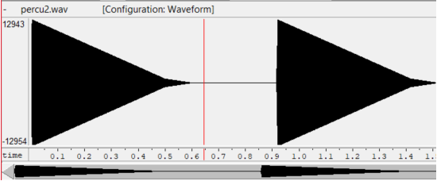
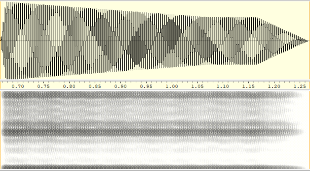

PAV - P5: síntesis musical polifónica
=====================================

Obtenga su copia del repositorio de la práctica accediendo a [Práctica 5](https://github.com/albino-pav/P5) 
y pulsando sobre el botón `Fork` situado en la esquina superior derecha. A continuación, siga las
instrucciones de la [Práctica 2](https://github.com/albino-pav/P2) para crear una rama con el apellido de
los integrantes del grupo de prácticas, dar de alta al resto de integrantes como colaboradores del proyecto
y crear la copias locales del repositorio.

Como entrega deberá realizar un *pull request* con el contenido de su copia del repositorio. Recuerde que
los ficheros entregados deberán estar en condiciones de ser ejecutados con sólo ejecutar:

~~~~~~~~~~~~~~~~~~~~~~~~~~~~~~~~~~~~~~~~~~~~~~~~~~~~~.sh
  make release
~~~~~~~~~~~~~~~~~~~~~~~~~~~~~~~~~~~~~~~~~~~~~~~~~~~~~

A modo de memoria de la práctica, complete, en este mismo documento y usando el formato *markdown*, los
ejercicios indicados.

Ejercicios.
-----------

### Envolvente ADSR.

Tomando como modelo un instrumento sencillo (puede usar el InstrumentDumb), genere cuatro instrumentos que
permitan visualizar el funcionamiento de la curva ADSR.

* Un instrumento con una envolvente ADSR genérica, para el que se aprecie con claridad cada uno de sus
  parámetros: ataque (A), caída (D), mantenimiento (S) y liberación (R).

INSTRUMENTO GENÉRICO:
	
Para realizarlo hemos decidido los siguientes parámetros:

1    InstrumentDumb    ADSR_A=0.02; ADSR_D=0.1; ADSR_S=0.4; ADSR_R=0.1; N=40;

Como vemos la fase de ataque es más o menos igual de pronunciada que la liberación. Hemos decidido que la caída sea larga y el mantenimiento tenga una duración corta. El instrumento genérico se ve así:

 

* Un instrumento *percusivo*, como una guitarra o un piano, en el que el sonido tenga un ataque rápido, no
  haya mantenimiemto y el sonido se apague lentamente.
  - Para un instrumento de este tipo, tenemos dos situaciones posibles:
    * El intérprete mantiene la nota *pulsada* hasta su completa extinción.
    * El intérprete da por finalizada la nota antes de su completa extinción, iniciándose una disminución
	  abrupta del sonido hasta su finalización.
  - Debera representar en esta memoria **ambos** posibles finales de la nota.

INSTRUMENTO PERCUSIVO 1: 

Para realizarlo hemos decidido los siguientes parámetros:

1   InstrumentDumb    ADSR_A=0.005; ADSR_D=0.5; ADSR_S=0.05; ADSR_R=0.1; N=40;

Ampliado vemos esto:

Y en global queda así:

INSTRUMENTO PERCUSIVO 2: 
	
Para realizarlo hemos decidido los parámetros anteriores, salvo que en este caso hemos decidido incluir un pequeño delay el doremi.sco  después de la primera nota quedando así:

                  (60  8   1   60  10)

* Un instrumento *plano*, como los de cuerdas frotadas (violines y semejantes) o algunos de viento. En
  ellos, el ataque es relativamente rápido hasta alcanzar el nivel de mantenimiento (sin sobrecarga), y la
  liberación también es bastante rápida.

INSTRUMENTO PLANO:
 
Para realizarlo hemos decidido los siguientes parámetros:

1    InstrumentDumb    ADSR_A=0.07; ADSR_D=0.3; ADSR_S=1; ADSR_R=0.125; N=40;

Para los cuatro casos, deberá incluir una gráfica en la que se visualice claramente la curva ADSR. Deberá
añadir la información necesaria para su correcta interpretación, aunque esa información puede reducirse a
colocar etiquetas y títulos adecuados en la propia gráfica (se valorará positivamente esta alternativa).

### Instrumentos Dumb y Seno.

Implemente el instrumento `Seno` tomando como modelo el `InstrumentDumb`. La señal **deberá** formarse
mediante búsqueda de los valores en una tabla.

- Incluya, a continuación, el código del fichero `seno.cpp` con los métodos de la clase Seno.

seno::seno(const std::string &param): adsr(SamplingRate, param) {
  bActive = false;
  x.resize(BSIZE);

  /*
    You can use the class keyvalue to parse "param" and configure your instrument.
    Take a Look at keyvalue.h    
  */
  KeyValue kv(param);
  int N;

  if (!kv.to_int("N",N))
    N = 40; //default value
  
  //Create a tbl with one period of a sinusoidal wave
  tbl.resize(N);
  float phase = 0, step = 2 * M_PI /(float) N;
  index = 0;
  for (int i=0; i < N ; ++i) {
    tbl[i] = sin(phase);
    /*Para obtener el fichero tbl.txt habilitar el comment de abajo y en el terminal 
    poner la línea que crea el .wav añadir al final de la cual añadiremos >tbl.txt*/
    cout << tbl[i] << "\n"; 
    phase += step;
  }
}

void seno::command(long cmd, long note, long vel) {
  if (cmd == 9) {		//'Key' pressed: attack begins
    bActive = true;
    adsr.start();
    index = 0;
	  A = vel / 127.;
    //adding the note: A
    float f0 = (440.00*pow(2,((float)note-69.00)/12.00))/SamplingRate; 
    step = tbl.size()*f0;
  }
  else if (cmd == 8) {	//'Key' released: sustain ends, release begins
    adsr.stop();
  }
  else if (cmd == 0) {	//Sound extinguished without waiting for release to end
    adsr.end();
  }
}

const vector<float> & seno::synthesize() {
  if (not adsr.active()) {
    x.assign(x.size(), 0);
    bActive = false;
    return x;
  }
  else if (not bActive)
    return x;
  
  for (unsigned int i=0; i<x.size(); ++i) {
    if (round(index*step) == tbl.size())
      index = 0;

    x[i] = A * tbl[round(index*step)]; 
    /*Para obtener el fichero x.txt habilitar el comment de abajo y en el terminal 
    poner la línea que crea el .wav añadir al final de la cual añadiremos >x.txt*/
    //cout << x[i] << "\n";
    index++;
  } 
  adsr(x); //apply envelope to x and update internal status of ADSR

  /*ofstream output_file("/mnt/c/Users/Patron/Desktop/2020 Q2/PAV/LAB/P5/work");
  ostream_iterator<int> output_iterator( output_file, "\n" );
  // Passing all the variables inside the vector from the beginning of the vector to the end.
  copy( x.begin( ), x.end( ), output_iterator );*/

  /*char buffer[256];
  char *val = getcwd(buffer, sizeof(buffer));
  if (val) {
    std::cout << buffer << std::endl;
  }*/

  return x;
}

- Explique qué método se ha seguido para asignar un valor a la señal a partir de los contenidos en la tabla,
  e incluya una gráfica en la que se vean claramente (use pelotitas en lugar de líneas) los valores de la tabla y los de la señal generada.

Para realizar este apartado lo que hemos planteado es:

1) Cogiendo la información dada por la documentación de la práctica que nos dice que:

                    Note=69+12*log2(f0/440)

Podemos obtener la frecuencia fundamental quedando de la siguiente forma:

                    f0=440^2(note-69)/12

Para calcular el valor del 'step', debemos tener en cuenta que la frecuencia del seno que ha generado la tabla es modificable según la velocidad a la que esta se recorre. Por ello cada 'step' resulta como:

                    step=f0*longitudTabla/fm

Por tanto deberíamos recorrer la tabla con cada 'step' que se da, y en caso de que el valor del índice en que nos encontramos supere el de la longitud de la tabla, entonces el algoritmo que planteamos debería hacer que el índice retornase a 0 volviendoa empezar.

La gráfica nos queda así:

Creemos que la gráfica debería salir de forma que las amplitudes de ambas senoides fueran las mismas así como su periodo, pero esto no es así como podemos ver.

- Si ha implementado la síntesis por tabla almacenada en fichero externo, incluya a continuación el código
  del método `command()`.

### Efectos sonoros.

- Incluya dos gráficas en las que se vean, claramente, el efecto del trémolo y el vibrato sobre una señal
  sinusoidal. Deberá explicar detalladamente cómo se manifiestan los parámetros del efecto (frecuencia e
  índice de modulación) en la señal generada (se valorará que la explicación esté contenida en las propias
  gráficas, sin necesidad de *literatura*).

El seno con trémolo es el siguiente:

El seno con vibrato es el siguiente:

Comparando el seno sin nada, con tremolo y con vibrato de cerca:

  Seno simple:

  Seno tremolo:

  Seno vibrato:

Como vemos el seno con trémolo genera ondulaciones en la amplitud del señal temporal mientras que el  vibrato presenta ondulaciones en el espectrograma.

- Si ha generado algún efecto por su cuenta, explique en qué consiste, cómo lo ha implementado y qué
  resultado ha producido. Incluya, en el directorio `work/ejemplos`, los ficheros necesarios para apreciar
  el efecto, e indique, a continuación, la orden necesaria para generar los ficheros de audio usando el
  programa `synth`.

(ERIIIIIIIIIIIIIIIIIIIIIIIIIIIIIIIIIIIIIIIIIIIIIIIIIIIIIIC)

### Síntesis FM.

Construya un instrumento de síntesis FM, según las explicaciones contenidas en el enunciado y el artículo
de [John M. Chowning](https://ccrma.stanford.edu/sites/default/files/user/jc/fm_synthesispaper-2.pdf). El
instrumento usará como parámetros **básicos** los números `N1` y `N2`, y el índice de modulación `I`, que
deberá venir expresado en semitonos.

- Use el instrumento para generar un vibrato de *parámetros razonables* e incluya una gráfica en la que se
  vea, claramente, la correspondencia entre los valores `N1`, `N2` e `I` con la señal obtenida.

El vibratoFM nos resulta de la siguiente froma con los parámetros siguientes:

N1=3; N2=2; I=0.0001;

- Use el instrumento para generar un sonido tipo clarinete y otro tipo campana. Tome los parámetros del
  sonido (N1, N2 e I) y de la envolvente ADSR del citado artículo. Con estos sonidos, genere sendas escalas
  diatónicas (fichero `doremi.sco`) y ponga el resultado en los ficheros `work/doremi/clarinete.wav` y
  `work/doremi/campana.work`.

  * También puede colgar en el directorio work/doremi otras escalas usando sonidos *interesantes*. Por
    ejemplo, violines, pianos, percusiones, espadas láser de la
	[Guerra de las Galaxias](https://www.starwars.com/), etc.

### Orquestación usando el programa synth.

Use el programa `synth` para generar canciones a partir de su partitura MIDI. Como mínimo, deberá incluir la
*orquestación* de la canción *You've got a friend in me* (fichero `ToyStory_A_Friend_in_me.sco`) del genial
[Randy Newman](https://open.spotify.com/artist/3HQyFCFFfJO3KKBlUfZsyW/about).

- En este triste arreglo, la pista 1 corresponde al instrumento solista (puede ser un piano, flautas,
  violines, etc.), y la 2 al bajo (bajo eléctrico, contrabajo, tuba, etc.).
- Coloque el resultado, junto con los ficheros necesarios para generarlo, en el directorio `work/music`.
- Indique, a continuación, la orden necesaria para generar la señal (suponiendo que todos los archivos
  necesarios están en directorio indicado).

También puede orquestar otros temas más complejos, como la banda sonora de *Hawaii5-0* o el villacinco de
John Lennon *Happy Xmas (War Is Over)* (fichero `The_Christmas_Song_Lennon.sco`), o cualquier otra canción
de su agrado o composición. Se valorará la riqueza instrumental, su modelado y el resultado final.
- Coloque los ficheros generados, junto a sus ficheros `score`, `instruments` y `efffects`, en el directorio
  `work/music`.
- Indique, a continuación, la orden necesaria para generar cada una de las señales usando los distintos ficheros.

(ERIIIIIIIIIIIIIIIIIIIIIIIIIIIIIIIIIIIIIIIIIIIIIIIIIIIIIIC)
